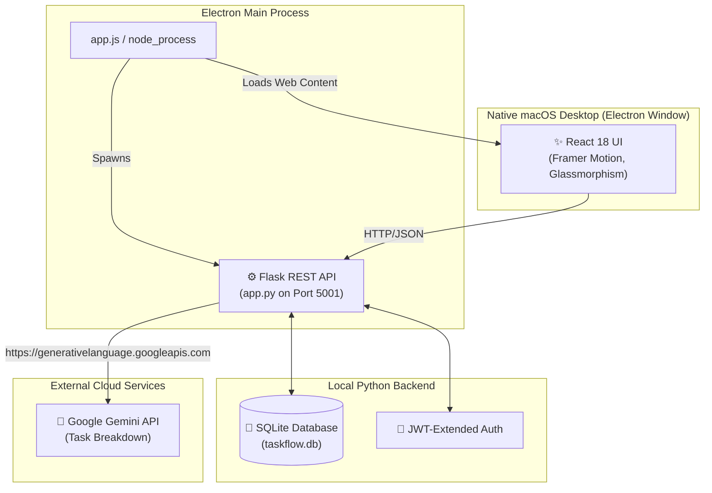

<div align="center">

# ⚡ TaskFlow : God-Tier Productivity

<p align="center">
  
  
  
  
  
  
</p>

### Elevate your work. Destroy your to-do list. Let AI do the heavy lifting.

*TaskFlow is an enterprise-grade, intelligence-driven productivity suite bridging the gap between a stunning Glassmorphism UI and a robust, scalable Python backend. Packaged as a native macOS application via Electron.*

<br/>

</div>

---

## 🛠 Technical Architecture

TaskFlow utilizes a decoupled client-server architecture, allowing the API to be consumed by the web client, potential mobile clients, and the wrapped Electron desktop application.



### Frontend Client (React)
- **Framework:** React 18
- **Routing:** React Router DOM (v6)
- **State Management:** React Context API (`AuthContext`) + Local Component State
- **Styling:** Vanilla CSS (`index.css`) with CSS Variables implementing a custom component-based Design System (Glassmorphism).
- **Animations:** Framer Motion (`framer-motion`) orchestrating complex layout transitions, staggered mount animations, and micro-interactions.
- **Data Visualization:** Chart.js + `react-chartjs-2` (Pie/Bar charts) and custom DOM-based components (GitHub-style Heatmap).
- **Desktop Packaging:** Electron (`electron`, `electron-builder`) wrapping the React build and spawning the Flask subprocess.

### Backend Server (Flask)
- **Framework:** Flask (Python 3)
- **Database:** SQLite3 using direct DB-API connections via `extensions/db.py`.
- **Authentication:** `flask-jwt-extended` utilizing stateless JSON Web Tokens for secure route protection.
- **AI Integration:** Google Gemini REST API via built-in `urllib.request` (zero heavy external AI dependencies).
- **Export Engine:** `fpdf` for programmatic PDF generation.
- **CORS:** Pluggable cross-origin resource sharing enabled for isolated frontend development.

---

## 💾 Database Schema (SQLite)

The relational database is architected to eliminate data redundancy and ensure cascading referential integrity.

- **`users`**: `id` (PK), `username`, `email` (UNIQUE), `password_hash`, `points`, `level`, `avatar` (BLOB), `streak`, `last_completed_date`.
- **`todos`**: `id` (PK), `user_id` (FK), `title`, `description`, `status`, `priority`, `category`, `due_date`, `completed`, `is_recurring`, `recur_interval`, `is_focus`, `total_time_secs`.
- **`subtasks`**: `id` (PK), `todo_id` (FK), `title`, `completed`.
- **`comments`**: `id` (PK), `todo_id` (FK), `user_id` (FK), `text`.
- **`badges`**: `id` (PK), `user_id` (FK), `badge_key` (UNIQUE constraints).
- **`time_logs`**: `id` (PK), `todo_id` (FK), `started_at`, `stopped_at`, `duration_secs`.
- **`tags` / `todo_tags`**: Many-to-many relationship mapping custom tags to distinct tasks.

---

## 🔌 API Endpoints
All protected routes require an `Authorization: Bearer <token>` header.

### Authentication (`/auth`)
- `POST /auth/register` - Create user
- `POST /auth/login` - Authenticate & retrieve JWT
- `PUT /auth/profile` - Update user avatar (Base64)
- `GET /auth/profile` - Retrieve user details

### Tasks (`/todos`)
- `GET /todos/all` - Fetch all tasks for authenticated user
- `POST /todos/` - Create new task
- `PUT /todos/<id>` - Update task state (and compute XP/Level progression)
- `DELETE /todos/<id>` - Remove task
- `GET /todos/stats` - Aggregated analytics (Total, Completed, Karma, Level, By Status/Priority/Category)

### Task Modules (`/todos`)
- **Subtasks**: `POST /todos/<id>/subtasks`, `PUT /todos/subtasks/<id>/toggle`, `DELETE /todos/subtasks/<id>`
- **AI Integration**: `POST /todos/ai-breakdown` (Payload: `{ "goal": "..." }`)
- **PDF Export**: `POST /todos/export` (Returns `application/pdf` blob)
- **Comments**: `GET|POST /todos/<id>/comments`, `DELETE /comments/<id>`
- **Time Tracker**: `POST /todos/<id>/timer/start`, `POST /todos/<id>/timer/stop`
- **Focus Mode**: `PUT /todos/<id>/focus` (Toggles daily focus pin)

### Global Modules (`/`)
- **Tags**: `GET|POST /tags`, `DELETE /tags/<id>`, `POST|DELETE /todos/<id>/tags`
- **Analytics**: `GET /streak`, `GET /heatmap`, `GET /todos/overdue`

---

## ✨ God-Tier UX Features

<table>
  <tr>
    <td width="50%">
      <h3>🧠 AI-Powered Task Breakdown</h3>
      <p>Click the brain icon on any task. The backend proxies a prompt to <b>Gemini AI</b> to instantly generate 4-6 actionable subtasks. Features an algorithmic fallback array if API limits are reached without crashing the client.</p>
    </td>
    <td width="50%">
      <h3>🏆 Karma & Gamification Engine</h3>
      <p>Backend middleware calculates <b>Karma XP</b> on task completion. Leveling up or hitting milestones dynamically injects <b>Achievement Badges</b> into the API response to trigger frontend Framer Motion toast notifications.</p>
    </td>
  </tr>
  <tr>
    <td width="50%">
      <h3>🌌 Tri-Modal Data Visualization</h3>
      <p>State mapped iteratively allowing seamless O(1) toggling between a <b>List</b>, a synchronized drag-and-drop <b>Kanban Board</b>, and a deterministic 7-day <b>Weekly Calendar</b>.</p>
    </td>
    <td width="50%">
      <h3>🧘 Immersive Zen Mode</h3>
      <p>Full-screen dimensional overlay combining a state-driven <b>Pomodoro timer</b> (Work/Short Break/Long Break) with randomized SVG particle generation for ambient, non-distracting focus.</p>
    </td>
  </tr>
  <tr>
    <td width="50%">
      <h3>⌨️ Command Palette (⌘K)</h3>
      <p>A globally scoped <code>keydown</code> listener triggering a high `z-index` omnibar. Enables instantaneous task creation and localized React Router navigation without mouse interaction.</p>
    </td>
    <td width="50%">
      <h3>🎙 Voice Intelligence</h3>
      <p>Integrates the native browser <b>Web Speech API</b>. Emits transcribed strings directly into the controlled component state of the Quick Add Task input.</p>
    </td>
  </tr>
</table>

---

## 🚀 Environment Setup

### 1. Backend Initialization (Python 3.9+)
```bash
cd backend
python3 -m venv venv
source venv/bin/activate
pip install -r requirements.txt
```

**Environment Variables:**
Create a `.env` file in the `backend/` directory:
```env
JWT_SECRET_KEY=your_secure_random_string
GEMINI_API_KEY=your_google_ai_studio_api_key
```

**Start the Server:**
```bash
python app.py
```
*Runs on `http://127.0.0.1:5001`. The script auto-initializes the SQLite database.*

### 2. Frontend Initialization (Node.js 18+)
```bash
cd frontend
npm install
npm start
```
*Runs on `http://localhost:3000`.*

---

## 🍏 Native macOS Desktop App Build

TaskFlow uses built-in scripts to compile the React application and bundle the Flask backend inside an Electron Wrapper. 

The `public/electron.js` entrypoint spawns a hidden Node `child_process` pointing to the Python venv executable, ensuring the API runs entirely locally within the desktop application context.

**Execute the Build Pipeline:**
```bash
cd frontend
npm run electron:build
```

**Build Output:**
The production-ready Application package is written to:
`frontend/dist/mac-arm64/TaskFlow.app`

*(Requires `electron-builder` to be installed and run on a macOS environment. The resulting binary is architecture specific based on the machine compiling it.)*

---

<div align="center">
  <p><b>TaskFlow — Architected for extreme performance, security, and aesthetics.</b></p>
</div>
